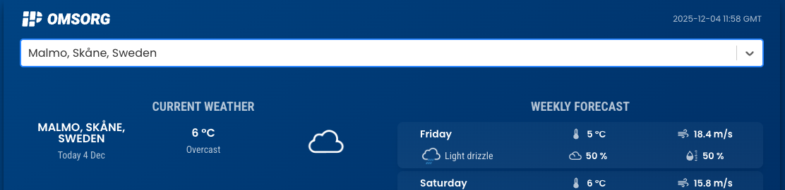

<br/>
<br/>

Med appen IP Julskinka Weather Forecasting kan användare söka efter orter och se aktuellt väder samt prognoser för de kommande sju dagarna.
<br />
Appen är utvecklad med React.js och Material-UI och använder nu Open-Meteos API:er för väderdata och stadssökning.
<br />


## ⚡ Quick Start

1. **Install dependencies:**
   <br />
Detta steg skall vara klart på din dator

```bash
npm install
```

2. **Starta appen:**
   <br />
Ta fram en terminal i ditt IDE och testa att det går att starta appen.
```bash
npm start
```

## Tips
- Använd Architect mode och diskutera er fram till en lösning innan ni låter Kilo börja skriva kod
- Commita ofta så att det är enkelt att gå tillbaka och börja om ifall det behövs
- Om Kilo hänger, återställ till senaste Checkpoint och välj Resume Task
- Använd screenshots i dina promptar för att göra dom mer beskrivande

## Uppgifter

1. **Nuvarande plats**<br />
Gör det enkelt för användaren att välja staden de befinner sig i.

2. **Senaste sökning**<br />
Kom ihåg den senaste väderprognosen som laddades och ladda den när appen startas.

3. **Fel i tim-baserad prognos**<br />
På den nedre delen av sidan visas prognos för temperatur för 6 timmar framåt. Den börjar dock 4 timmar fram istället för nästa timme.

4. **Längre prognos**<br />
Ändra så att användare kan bläddra fram fler prognoser för längre än 6 timmar fram.
